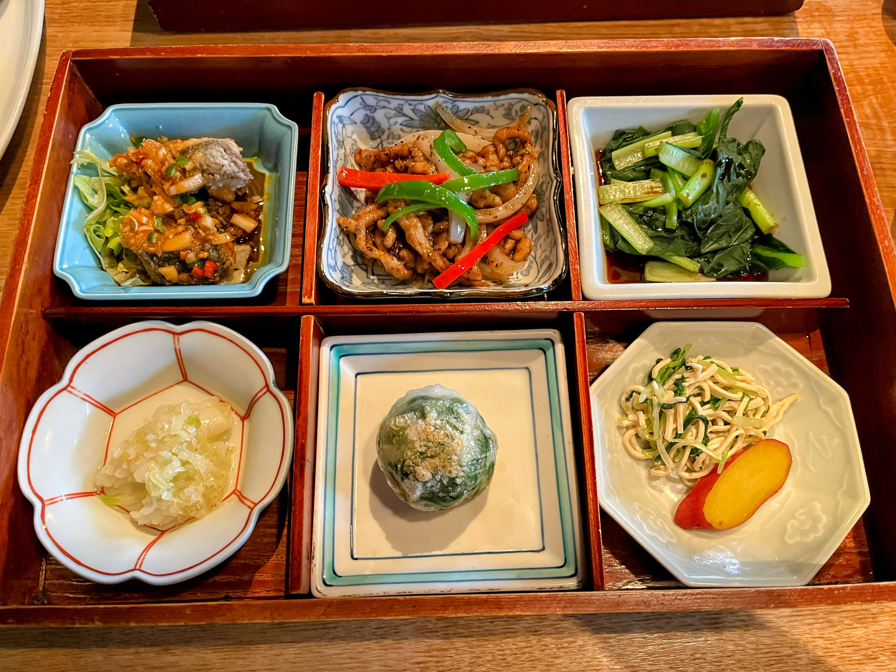
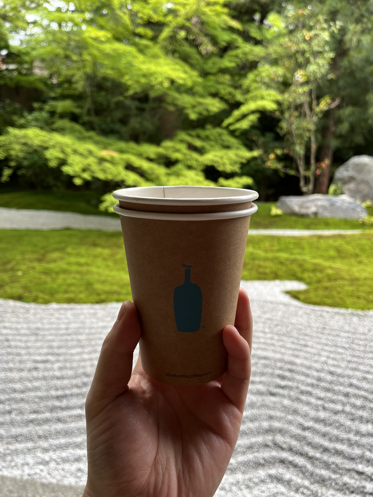
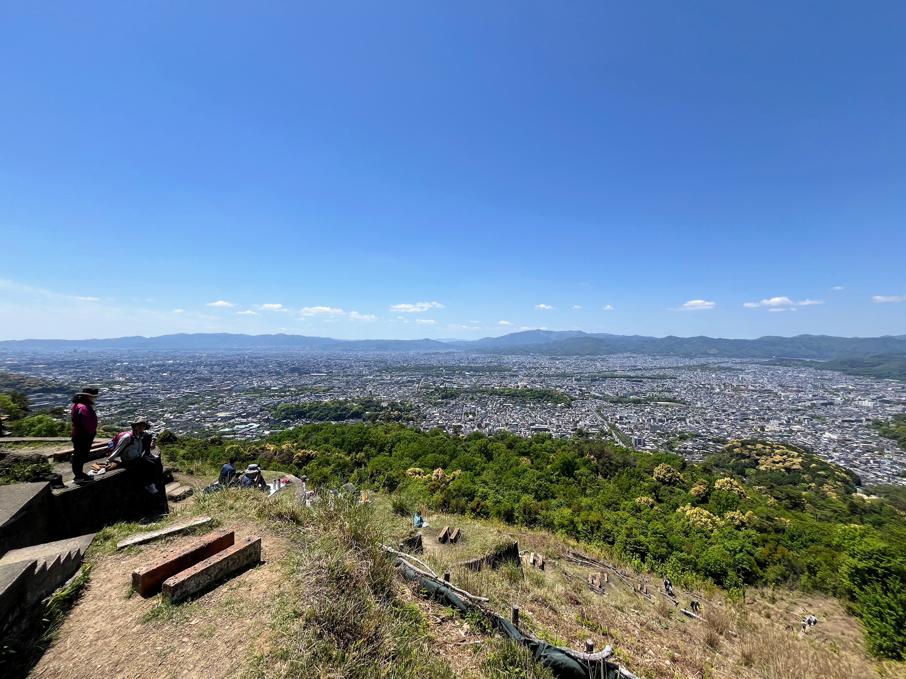

ゴールデンウィークの京都に行った。

<!-- truncate -->

## 雪梅花 菜根譚

雪梅花という中華屋さんでランチの御弁當を食べた。それぞれの小鉢で毎回驚くほど美味しい。

古民家を改修した建物になっていて、内装や中庭も雰囲気がある。

[Google マップ](https://maps.app.goo.gl/NLucpAn5PBLHronn9)

## 西来院

建仁寺の敷地内にある寺院。ブルーボトルのコーヒートラックが門の前に出店していた。

聞き耳を立てて住職と来訪客の話を聞いていた。このお寺の枯山水は四川の雲海と山々を表現しているそう。

そう言われてみると高い峰から雲海を見下ろしているような気分になった。

[Google マップ](https://maps.app.goo.gl/Dr34DSCQFRVVwCeXA)

## 大文字山

久しぶりに登った。火床は今まで見たことのない賑わいだった。

おそらく京都のできるだけあらゆる場所から五山送り火が見られるような場所に火床を作ったのだと思う。そう考えるとここまで開けていて広い範囲が見渡せることはあるいは当たり前で、こういう山は稀有なのかもしれない。

## 瑠璃光院

瑠璃は鮮やかな青色という意味らしい。昔は青と緑の区別がなかったことを考えると、正に瑠璃色の新緑に満たされていた。

## Nintendo KYOTO

Nintendo TOKYO に比べて広くて、人口密度が低くて見やすかった。
