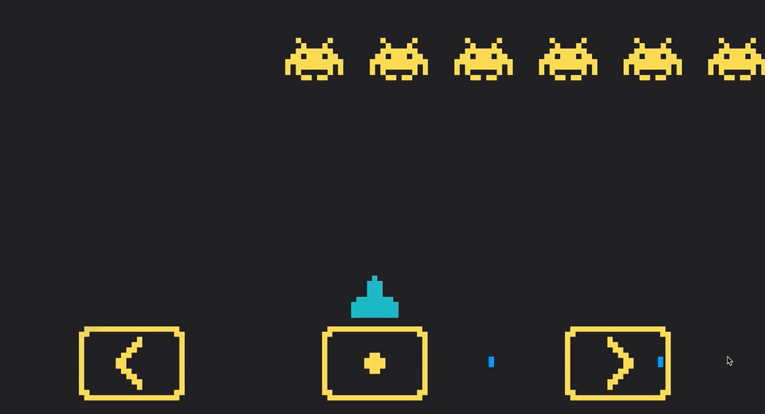

## Me

- :bust_in_silhouette: Arata Sato / 佐藤 新太

## Works

### 札幌 ToGo

2020.05 - 2020.09

札幌でテイクアウトを予約、オンライン決済できるサービスを友人と開発しました。サーバーサイドを一人で担当しました。

tags: _Node.js, TypeScript, AWS, Firebase, Sentry, PostgreSQL, React_

### Relaym

2019 -

BGM をその場にいる人が投稿によって決める Web アプリの開発に参加しました。Spotify の API を使っています。フロントエンドを担当しました。

- [Relaym](https://relaym.camph.net/)
- [relaym-client](https://github.com/camphor-/relaym-client)
- [relaym-server](https://github.com/camphor-/relaym-server)

tags: _Vue, Vuex, TypeScript, Netlify_

<!--  -->

### Message Invaders

2019.03

メッセージをインベーダーゲームにして共有できる Web アプリ。p5.js で作りました。Firebase でホストしています。

- [Message Invaders](https://mi.ataran.me/)
- [atrn0/message-invaders](https://github.com/atrn0/message-invaders)

## Internships

- Weblio, Inc. (2019.05 - 2019.12)
- teamLab (2019.09)
- cookpad (2020.04)
- mixi (2020.08 - 2020.09)
- DeNA (2020.08)
- Wantedly (2021.02 - 2021.03)
